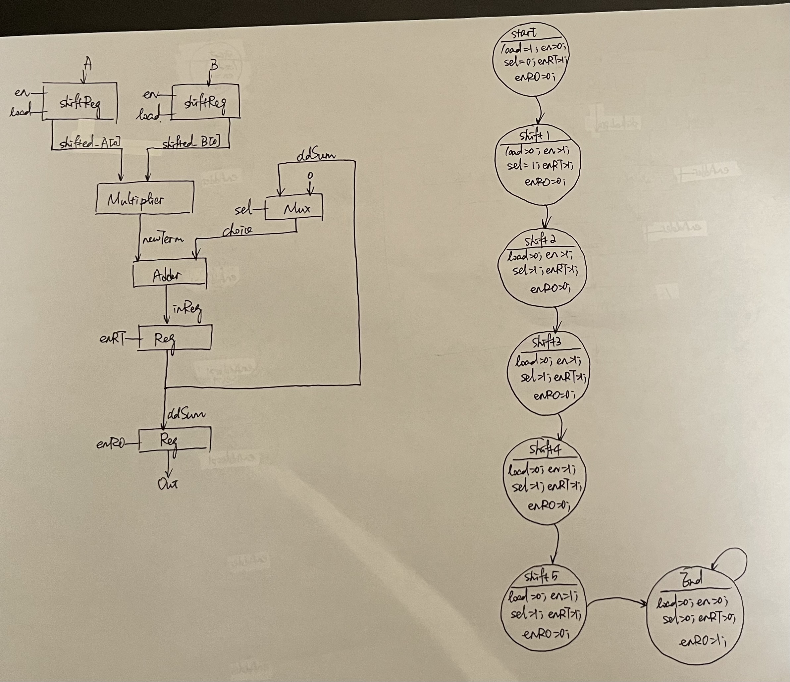

# 98154 - Convolutor Tape Out

Yushuang Liu
98154 Spring 2023 Final Tapeout Project

## Overview

This device takes in two 6-bit inputs and outputs their convolution results. To accomodate chip manufacturing requirements, the two inputs are combined into one 12-bit input io_in.

## How it Works

The input signals are passed into shift registers to get the LSB's on every rising clock edge. The LSB's are then input into a one-bit multiplier (implemented simply as anding). An adder sums together all the products. One of the inputs is the new product, and the other is either the existing sum or zero, selected by a Mux. Final output is stored to a register. All devices are controlled by an FSM with 7 states.

Here is the RTL and FSM for the design:

## Inputs/Outputs

Despite the designated pins used for clock and reset, the 12-bit input is divided into even halves to create two inputs for the convolution. The output is the lower 4 bits of the 12 pins.

## Hardware Peripherals

No additional hardware peripherals is used.

## Design Testing / Bringup

The design is tested with a testbench written in SystemVerilog. 

## Media

Design and testbench are built on EDAPlayground:
https://edaplayground.com/x/mEaa